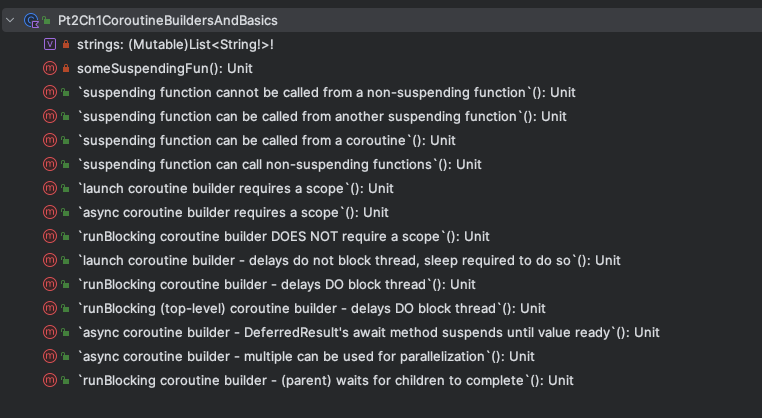
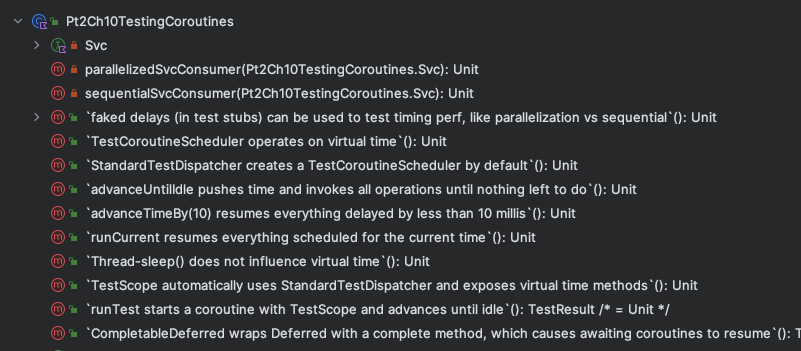
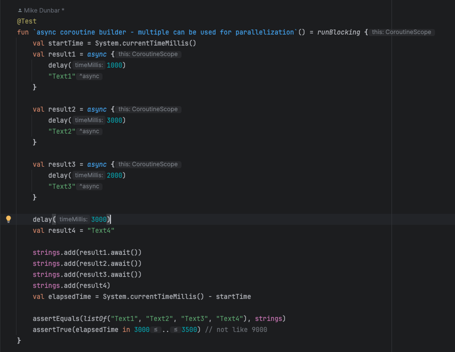
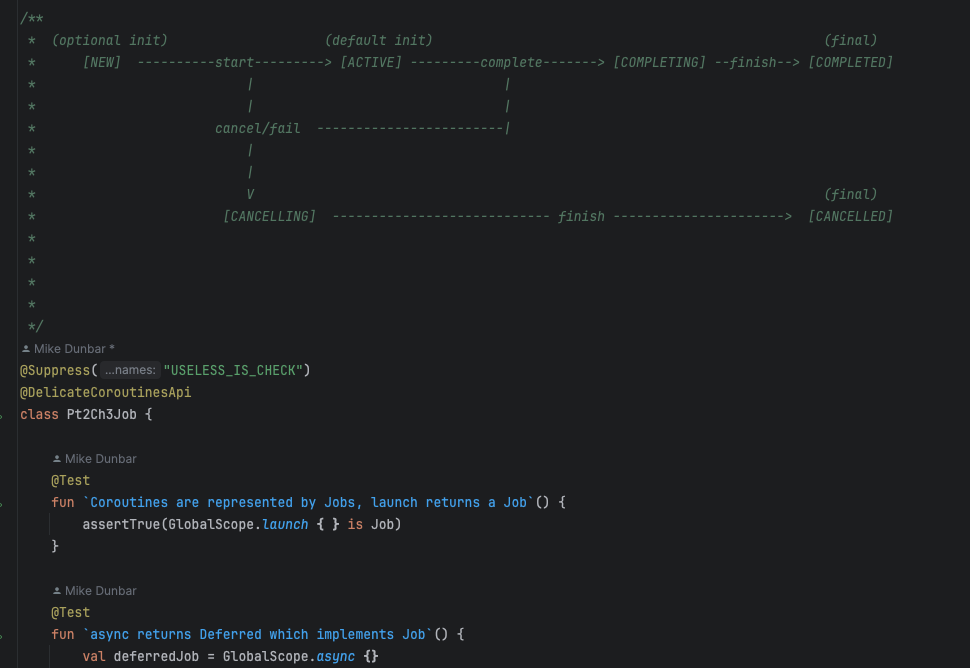

# Understanding Coroutines With Tests
Unit tests to illustrate the concepts in the book Kotlin Coroutines, by Marcin Moskala.

Test methods are named after the concept they are testing, and can be skimmed as a quick refresher.

For a deeper review, the tests can be run, studied, updated, etc.

Diagrams included when it makes sense

